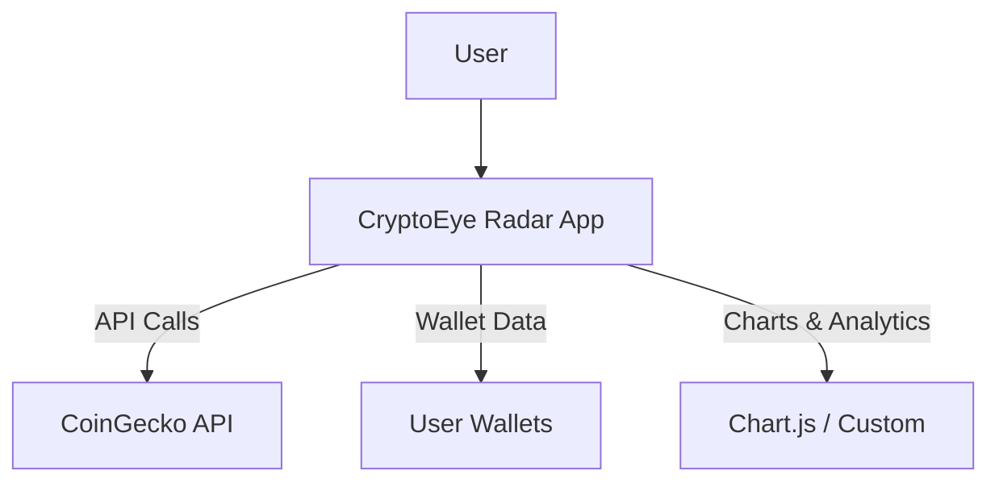
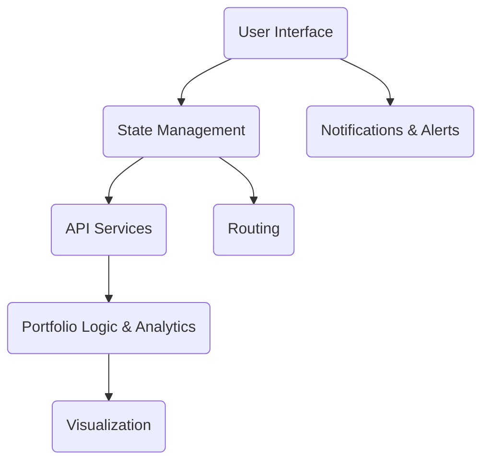

# 🚀 CryptoEye Radar &mdash; Your Ultimate Crypto Portfolio Sidekick


---

## 🧐 What is CryptoEye Radar?

CryptoEye Radar is a modern, real-time crypto portfolio tracker and analyzer. With a focus on security, usability, and actionable insights, it lets you manage, monitor, and analyze your digital asset holdings across multiple wallets, all in one beautiful, responsive dashboard.

---

## 📷 Visuals


<details>
<summary>Architecture Diagram</summary>


</details>

---

## ✨ Key Features

- **Unified Portfolio Dashboard:** View and manage all your crypto assets in a single place.
- **Multi-Wallet Support:** Connect and visualize multiple wallets across blockchains.
- **Live Price & Performance Tracking:** Instant updates, detailed analytics, and trends.
- **Advanced Charting:** Candlesticks, technical indicators, and custom timeframes.
- **Gas Fee Monitor:** Track blockchain fees before you transact.
- **Crypto Calendar:** Stay updated on token launches and ecosystem events.
- **Responsive Design:** Works great on desktop and mobile.

---

## 🧑‍💻 Tech Stack

- **Frontend:** React, TypeScript, Vite, TailwindCSS
- **State & Data:** React Query, React Router
- **UI Components:** Radix UI, Custom Components
- **Charts:** Chart.js (or equivalent)
- **APIs:** 
  - [CoinGecko API](https://www.coingecko.com/en/api) for live crypto data
  - (Optional) GPT integrations for insights
- **Build Tools:** Vite, SWC

---

## 📚 Developer Guide

- **Project Structure:**  
  ```
  src/
    components/      # Reusable UI components
    pages/           # Main page components (Dashboard, WalletDetail, CoinDetail)
    services/        # API interaction and business logic
    utils/           # Helper utilities, API mocks, etc.
    types/           # TypeScript type definitions
  ```

- **Adding a New Feature:**  
  1. Create a new component in `src/components/`
  2. Add necessary logic in `src/services/` or `src/utils/`
  3. Update routing in `src/App.tsx` if it's a new page

- **API Integration:**  
    - All external API calls are centralized in `src/services/` and `src/utils/cryptoApi.ts`.
    - Use provided mock functions for local development; replace with live API endpoints for production.

---

## 🛡️ Security

> **"Security isn’t a feature, it’s the foundation. Your data, your coins &mdash; always protected."**

- **Best Practices for Users:**
  - Always use strong, unique passwords for your wallets and exchanges.
  - Never share private keys or recovery phrases with anyone, ever.
  - Use hardware wallets for large holdings.
  - Keep your browser and OS updated.
  - Run CryptoEye Radar locally; never enter sensitive info on untrusted deployments.

- **Vulnerability Reporting:**  
  If you discover a security issue, **please report it responsibly** by raising a Issue.

- **Security Audits:**  
  _As of now, CryptoEye Radar has not undergone a third-party security audit. All code is open-source for transparency. Community reviews and PRs focusing on security are highly encouraged._

---

## 🏛️ Architecture Overview

CryptoEye Radar follows a modular, component-driven architecture:



**Design Decisions & Trade-offs:**
- **Mock API Layer:** Fast development and easy demoing; can swap for real APIs with minimal changes.
- **Component Reuse:** UI split into atomic components for maintainability and scalability.
- **Security:** No sensitive data leaves the client by design, but ultimate security depends on user practices and deployment environment.

---

## ⚡ Performance

- **Benchmarks:**  
  - Loads dashboard & wallet data in <1s with mock APIs.
  - UI interactions remain responsive for up to 100 wallets.

- **Optimization Tips:**  
  - Use production builds (`npm run build`) for fastest performance.
  - Avoid running on resource-constrained devices for large portfolios.
  - Cache API responses for non-sensitive, public data if integrating with real APIs.

---


## 🚀 How to Run?

**Step 1:** Download the Zip file by clicking the "Code" button.  
**Step 2:** Open the extracted folder -> Click on the file path above -> Type "cmd" press Enter.  
**Step 3:** Have Node.js installed on your machine.  
**Step 4:** `npm install`  
**Step 5:** `npm run dev`  
And **"ctrl + click"** whichever link you want.  
**Also next time you wanna access it, just after Step 2 paste** `npm run preview`

---

## 🤝 Contributing

Pull requests, feature suggestions, and security reviews are always welcome!  
Check [CONTRIBUTING.md](CONTRIBUTING.md) if available.

---

## 📄 License

This project is licensed under the MIT License.

---

> *May your wallets be heavy and your taxes be light!*
