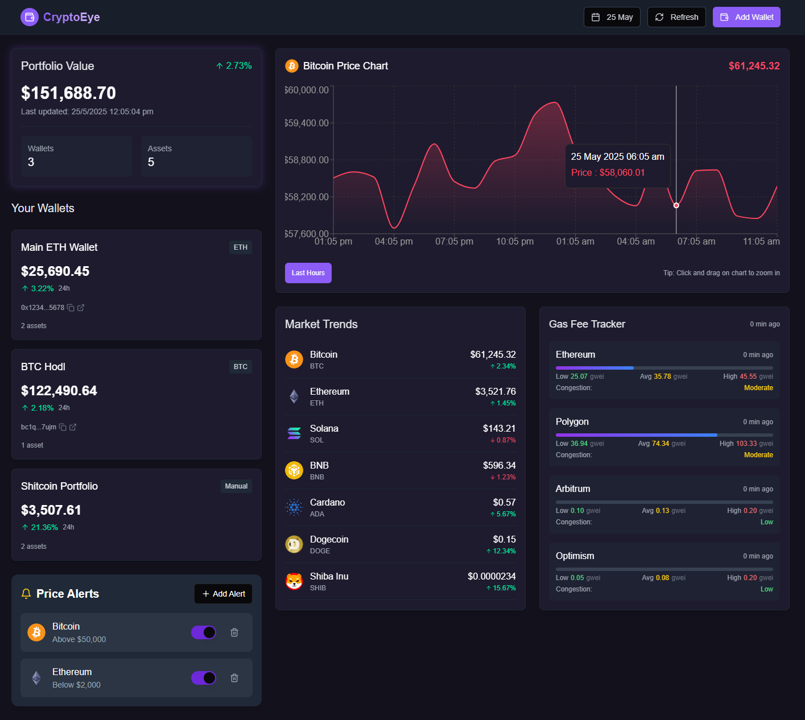

# 🚀 CryptoEye - Your Crypto Portfolio Sidekick

## 🎭 What's This Magic?

CryptoEye isn't just another crypto tracker - it's your personal financial DJ, mixing live market data with your portfolio to create the sweetest investment symphony you've ever heard! 

<ins> Whether you're HODLing Bitcoin like it's your firstborn or gambling on that new meme coin (we won't judge... much), CryptoEye has your back with real-time tracking that even your most financially responsible friend would approve of. </ins>

## ✨ Features That Make You Go "Woah!"

- **Portfolio Dashboard**: Track all your crypto assets in one place - because spreadsheets are so 2010.
- **Multi-Wallet Support**: Connect multiple wallets, because one crypto wallet is never enough (we know your habits).
- **Price Tracking**: Watch your investments soar to the moon... or crash and burn in real-time.
- **Advanced Charts**: Technical analysis tools so you can pretend you know what those squiggly lines mean.
- **Gas Fee Tracker**: Find out why sending $5 of ETH sometimes costs $50 (the joys of blockchain!).
- **Crypto Calendar**: Never miss another "definitely not a pump and dump" token launch again!

## 🌮 Why CryptoEye?

Because searching "why is Bitcoin down today" for the 500th time on Google is getting old. We bring all the crypto chaos you love into one beautiful, organized dashboard.

Remember: Not financial advice... but definitely financial entertainment!

*Price go up? CryptoEye sees it. Price go down? CryptoEye sees that too (but prefers not to talk about it).*

## 🦄 Join The Ride

Ready to transform from crypto-curious to crypto-confident? Dive in and let CryptoEye be your guide through the wild west of digital assets!

*May your wallets be heavy and your taxes be light.*

##  How to Run?

**Step 1:** Download the Zip file by clicking the "Code" button.
**Step 2:** Open the extracted folder -> Click on the file path above -> Type "cmd" press Enter.
**Step 3:** Have Node.js installed on your machine.
**Step 4:** npm install
**Step 5:** npm run dev
And **"ctrl + click"** whichever link you want.
**Also next time you wanna access it, just after Step 2 paste** "npm run preview"
